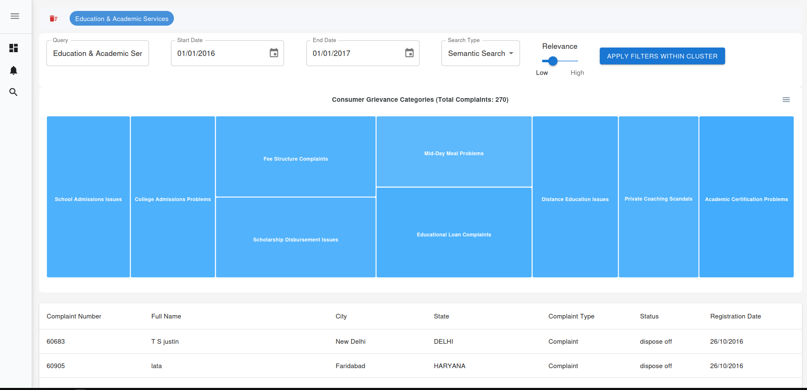
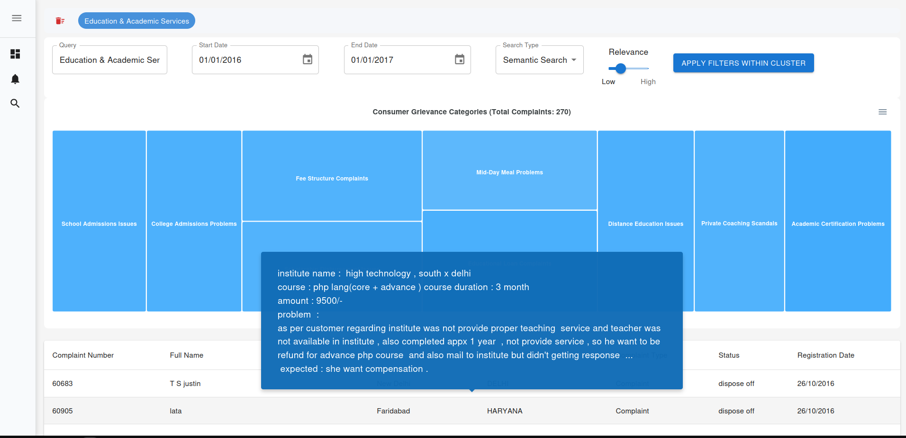
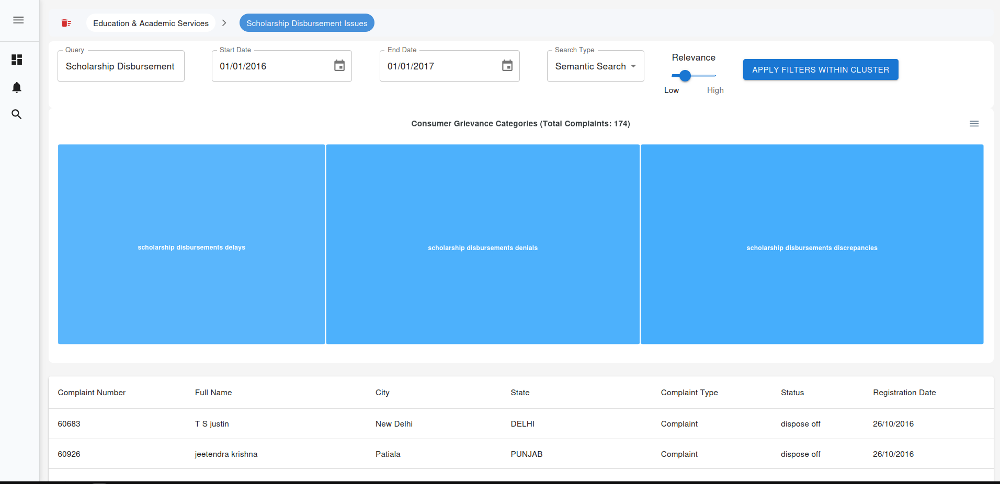
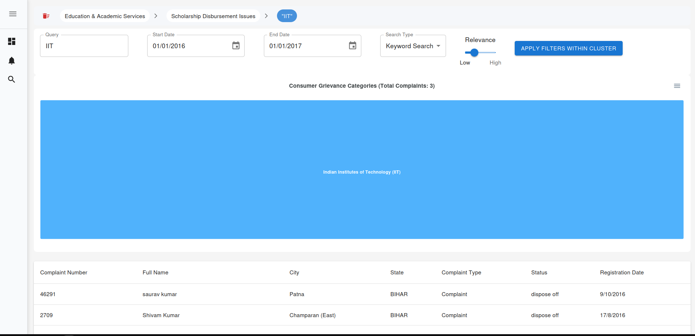
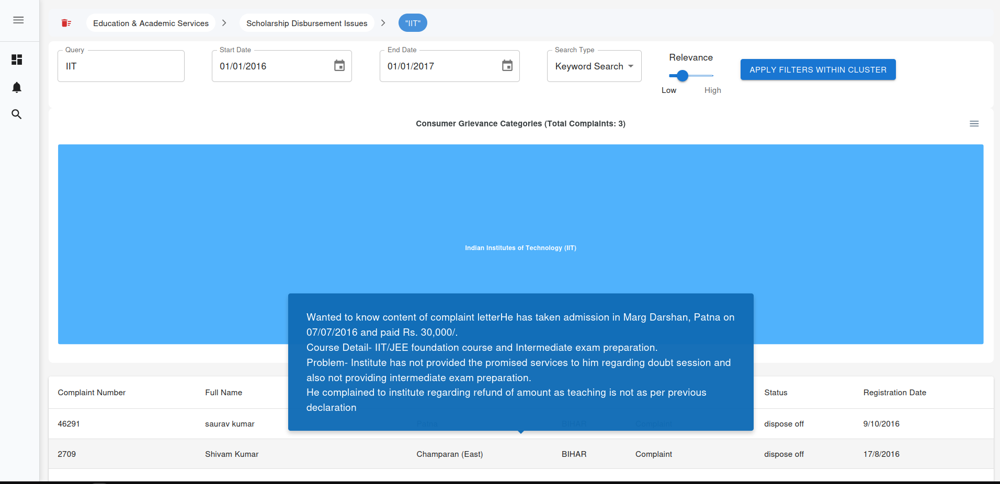
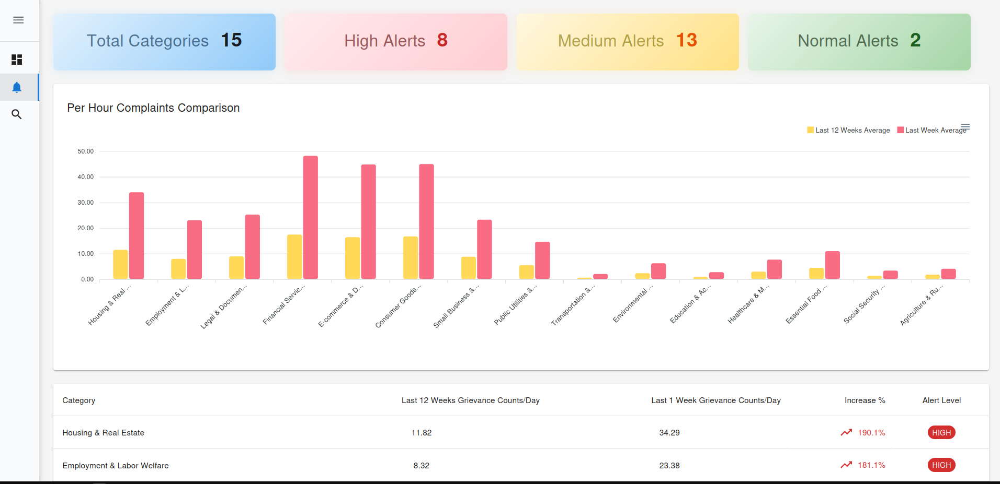
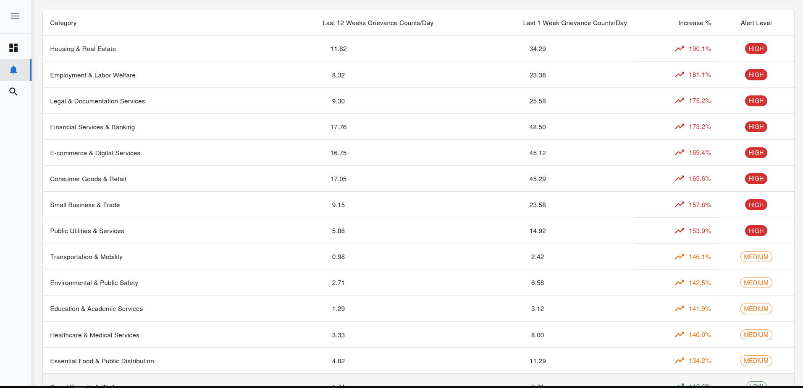
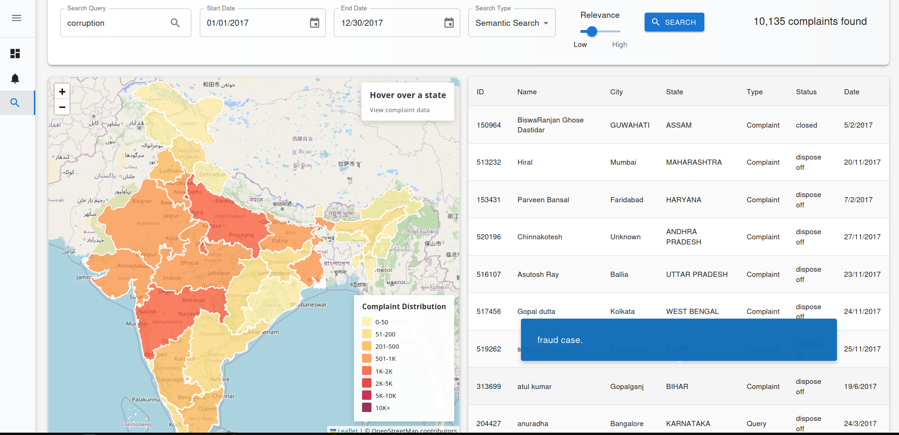

## consumer_affairs_dashboard_frontend

A dashboard frontend for Consumer Affairs.
It has the features of:

- Category Explorer
- Category Alerts
- Semantic Search

### Installation

1. Clone the repository:

   ```bash
   git clone https://github.com/your-username/consumer_affairs_dashboard_frontend.git
    cd consumer_affairs_dashboard_frontend
   ```
2. Install dependencies:

   ```bash
   npm install
   ```
3. Start the development server:

   ```bash
   npm run start
   ```
4. Open your browser and navigate to `http://localhost:3000` to view the dashboard.
5. To build the project for production, run:

   ```bash
   npm run build
   ```
6. The production-ready files will be in the `dist` directory.

### Demo Images

1. Category Explorer With a Query filter
   
2. Category Explorer with Result
   
3. Category Explorer, depicitng search inside the level 1 result ( Search within the cluster )
   
4. Category Explorer, Keyword search within the cluster
   
5. Category Explorer, Keyword Search results
   
6. Category Alerts
   
7. Category Alerts List
   
8. Semantic Search
   
